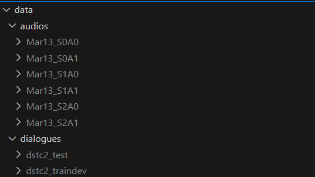

# Audio Embeddings for Chatbots

This repository coresponds to the experimental work of my Master's Thesis *Audio Embedding for Chatbot*, in part of the fullfilment of the [Master's degree in Advanced Telecommunication Technologies (MATT)](https://telecos.upc.edu/ca/estudis/masters/masters-degree-in-advanced-telecommunication-technologies-matt) at [Universitat Politècnica de Catalunya (UPC)](https://www.upc.edu/).

## Abstract

Spoken goal-oriented dialogue systems are increasingly popular for task management. They are composed of multiple modules, and one of the most important ones is the dialogue policy, which is responsible for determining system actions. Despite a priori one would think that speech is in the core of these systems, current systems typically rely only on audio transcriptions, or variables inferred from the transcript, as input.  In this master's thesis we extended the novel work in audio embedding-aware dialogue policies [1]. To do so, we propose new dialogue policy architectures to combine text and audio embeddings. Testing these on the DSTC2 dataset corroborates that audio embedding-aware policies outperform solely text-based ones [1], particularly in noisy transcription scenarios. This study demonstrates that sophisticated combinations of text and audio embeddings yield superior results.

## Repository Structure

The repository is structured as follows:

- data: Folder containing the raw data from the DSTC2 dataset. *data/zips/* contains the following zip files dowloaded directly from the [DSTC2 repository](https://github.com/matthen/dstc?tab=readme-ov-file).

- notebooks: Folder that contains the notebooks used to process the data, study it and doing the experiments.

    - 1.create_datasets: Folder with the notebooks that upload the DSTC2 to Huggin Face. In particular, notebook *create_dataset_dialogues.ipynb* creates the dataset with the correct transcripts of the conversations, and *create_dataset_audios.ipynb* does the same for the audio files.

    - 2.text_processing: Folder with the notebooks used to preprocess the dialogues before being used to train the models. The processing applied correspond to the one described in the Master's Thesis document. In particular, the folder contains notebook *dialogues_processing.ipynb* to concat the last 9 turns of the conversation, applying GPT-2 tokenizer, etc. and notebook *filtering_and_labels_dialogues_processed.ipynb* to do filter the messages for which there is an audio file and numerating the labels.

    - 3.audio_processing: Folder with the notebooks used to preprocess the audios before being used to train the models. Notebook *prepare_audios_[audio_embedding_model].ipynb* preprocesses the audios to used them as input for *[audio_embedding_model]* model. Also applies repetition padding so ensure that all audios have the same length.

    - 4.eda: Folder that contains *eda.ipynb* for exploratory data analysis purposes.

    - 5.experiments: Folder that contains the notebooks to do the experiments. The name of the subfolders and notebooks indicate the architecture, the audio embedding model used (if any) and whether the correct transcripts of the dialogues are used or those provided by a noisy ASR.

    - 6.results: Contains the notebooks for generating tables and graphics showing the performance of the models.

- finetuned_gpt2: Folder that stores finetuned three different Architecture 1 (terminology described in the Masther Thesis document) already trained. They are loaded when executing some training notebooks.

- output_data: Folder that stores the log files generated during training. These log files are loaded in the notebooks from *notebooks/6.results/*.

Notice that to execute the notebooks either in a local computer or cloud services such as Colab, most of the notebooks must be adapted to get the data from the correct paths. Also, notice that if any change in the notebooks for preprocessing the data is done, the output dataset of that notebook must be uploaded again, and the path of the dataset must correpond to one associated to your account.

## Hugging Face Datasets

To accelerate the experimental work, several datasets have been uploaded into Hugging Face.

- Correct transcripts:

    - [danielroncel/dstc2_dialogues](https://huggingface.co/datasets/danielroncel/dstc2_dialogues): Table with all the messages of all conversation of the DSTC2 dataset, both from users and system.

    - [danielroncel/dstc2_dialogues_processed](https://huggingface.co/datasets/danielroncel/dstc2_dialogues_processed): Table with a row per user message in the DSTC2 datset, concatenating the last 9 turns of the conversation, and GPT-2 tokenizer applied. Generated using as input danielroncel/dstc2_dialogues table.

    - [danielroncel/dstc2_dialogues_input_gpt2](https://huggingface.co/datasets/danielroncel/dstc2_dialogues_input_gpt2): Corresponds to danielroncel/dstc2_dialogues_processed table but with the labels encoded numerically.

- ASR transcripts:

    - [danielroncel/dstc2_dialogues_transcription](https://huggingface.co/datasets/danielroncel/dstc2_dialogues_transcription): Our ASR transcriptions of the DSTC2 user messages.

    - [danielroncel/dstc2_dialogues_transcription_processed](https://huggingface.co/datasets/danielroncel/dstc2_dialogues_transcription_processed): Analogous to danielroncel/dstc2_dialogues_processed dataset but for ASR transcriptions.

    - [danielroncel/dstc2_dialogues_transcript_input_gpt2](https://huggingface.co/datasets/danielroncel/dstc2_dialogues_transcript_input_gpt2): Analogous to danielroncel/dstc2_dialogues_input_gpt2 dataset but for ASR transcriptions.

- Audios:

    - [danielroncel/dstc2_audios](https://huggingface.co/datasets/danielroncel/dstc2_audios): Table with all the user audios of the DSTC2 dataset.

    - [danielroncel/dstc2_audios_input_wav2vec2](https://huggingface.co/datasets/danielroncel/dstc2_audios_input_wav2vec2): Dataset with audios preprocessed to be used as input for Wav2Vec2.0.

    - [danielroncel/dstc2_audios_input_hubert](https://huggingface.co/datasets/danielroncel/dstc2_audios_input_hubert): Dataset with audios preprocessed to be used as input for HuBERT.

    - [danielroncel/dstc2_audios_input_uniSpeechSAT](https://huggingface.co/datasets/danielroncel/dstc2_audios_input_uniSpeechSAT): Dataset with audios preprocessed to be used as input for UniSpeechSAT.

    - [danielroncel/dstc2_audios_input_wavLM](https://huggingface.co/datasets/danielroncel/dstc2_audios_input_wavLM): Dataset with audios preprocessed to be used as input for WavLM.

The way this datasets were created and where are they used can be found by exploring the notebooks stored in this repository.

## Pretrained Architecture 1

To execute the models to train Architecture 2 and Architecture 3 models (terminology defined in the Master's Thesis document), you must have pretrained Architecture 1. You can obtain them by your own by training them using the model of this repository. Otherwise, you can download them from this [Google Drive folder](https://drive.google.com/drive/folders/1fWpRWctR7m_VtKmS5y9PbcFRYMVV-Ntn?usp=sharing) (the access to the folder is not permanently guaranteed, so we recommend to train your own Architecture 1 models). They cannot be uploaded into this GitHub repository due to memory restrictions.

## Other Comments

- The dataset (original text and audio) is too large to be hosted unzipped in this GitHub repository. Therefore, the original zip files are stored inside *data/zips/*. Both the transcripts and the audios are stored in Hugging Face. However, if because any reason you need to re-upload them, use the notebooks inside *notebooks/1.create_datasets*. To be executed, unzip the files so that the files look like this:

- In notebooks that run experiments using Architecture 2, the audio embedding layers output used as input for the linear predictor depend on the audio embedding model layer; they are those specified in the Master's Thesis document.

## Potential Future Work

All the experimental part of the project has been developed using Python notebooks. This is because the code was thought to be executed in Colab. However, if you plan to execute the experiments in another environment, consider moving the experiments code to scripts. Also, consider saving the prints of the notebooks that run experiments automatically in log files. It would avoid manually copying the results to log files.

As final comment, avoid executing the experiments in your own computer since experiments that use audios requiere more than 10 GB RAM.

## References

[1] Asier Lopez Zorrilla, Maria Ines Torres, and Heriberto Cuayahuitl. Audio embedding-aware dialogue policy learning. IEEE/ACM Transactions on Audio Speech and Lan- guage Processing, 31:525–538, 2023.